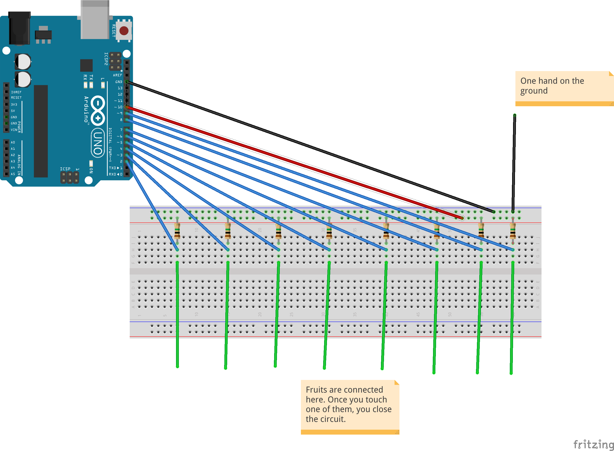

# BananaPiano
  * Project uses two approaches to create banana piano whith better sound effects than on Arduino buzzers:
    * [BananaPiano at Hackster](https://www.hackster.io/Baloo/banana-piano-5bb8b5) (simple, yet poor quality)
    * [Capacitive Sensors approach](https://www.instructables.com/id/Capacitive-Touch-Arduino-Keyboard-Piano/) (greate response, still easy)
  * Is is based on RXTX library for reading from serial port. Instruction to install: [RXTX](http://playground.arduino.cc/Interfacing/Java)
  * It is based on Midi synthesizer from javax: [MIDI](https://docs.oracle.com/javase/tutorial/sound/MIDI-synth.html), but in the project there is also available solution that does not require additional libraries and is based on sound synthesiser was taken from [csonder](https://github.com/csonder/Sound-Synthesizer)
  
## Diagram for Arduino
### Capacitive Sensors
In cacse of the capacitive sensors, the 10th input on the Arduino board is considered a "Send Input" and have to be connected to pin board before resistors.

I've tested different resistors, but the best response and stability I got with 2.2 MOhm resistors.

### Hackster version
The diagram is the same, but you need to put 5V before resistors and disconnect the 10th input.
 
